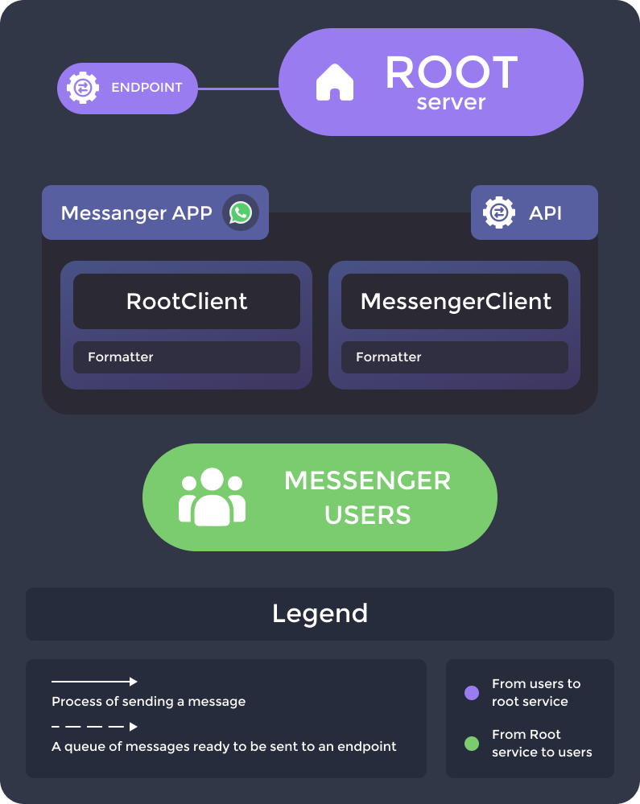

# WA-CLIENT
#### Менеджер сообщений мессенджера WhatsApp

> Приложение при получении сообщения из *мессенджера*, преобразовывает в валидный формат для *обозначенного сервера*, и помещает в очередь отправки на эндпоинт этого сервера.
Так же обьявлен эндпоинт самого приложения, по которому с обозначенного сервера могут приходить сообщения. При их получении, приложение преобразовывает в валидный для *мессенджера* формат, и помещает в очередь отправки до мессенджера.

## Оглавление
- [Работа приложения](#работа-приложения)
- [Ключевые зависимости](#ключевые-зависимости)
- [Запуск](#запуск)
- [Настройки](#настройки)
- [API](#api)
- [База данных / MongoDB](#база-данных--mongodb)
- [Архитектура](#архитектура)
- [Памятка разработчику](#памятка-разработчику)
  - [Локальный запуск](#локальный-запуск)
  - [Запуск через сборку проекта](#запуск-через-сборку-проекта)
- [Термины](#термины)

## Работа приложения

Основная задача приложения заключена в менеджменте сообщений из WhatsApp до выделенного сервера и от выделенного сервера в WhatsApp.

## Ключевые зависимости
 

